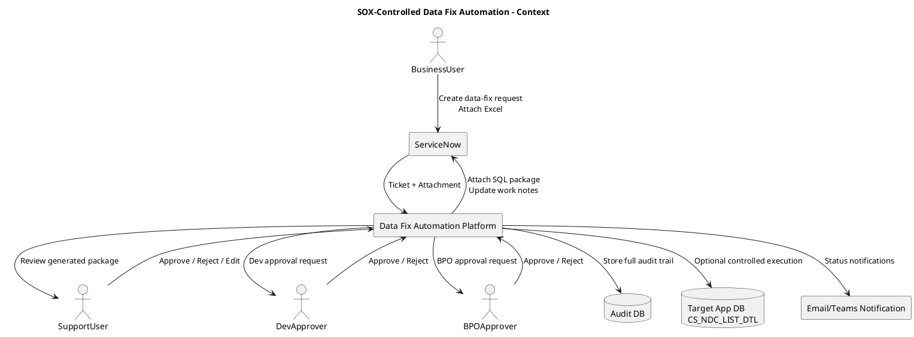
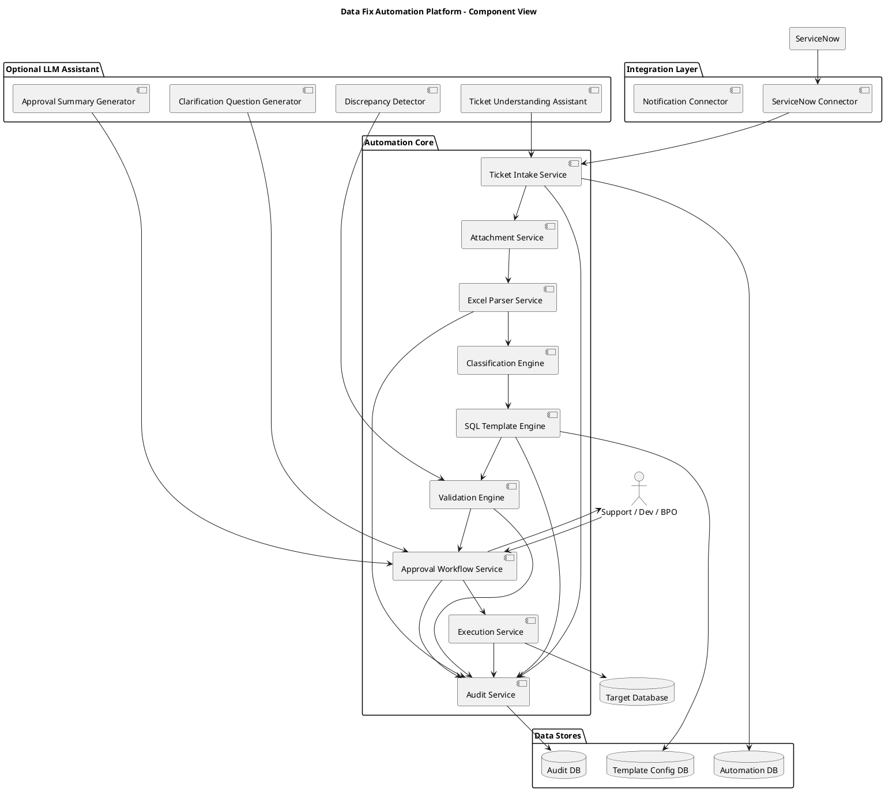
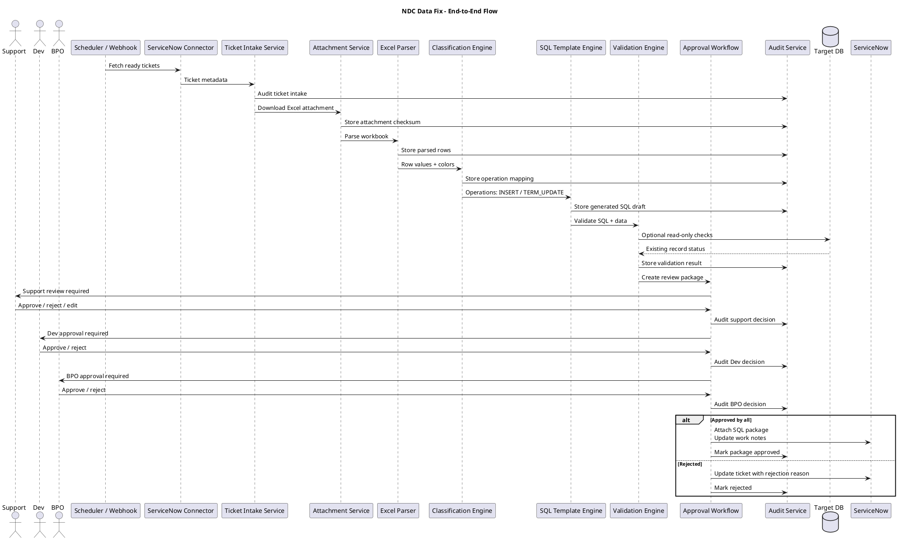
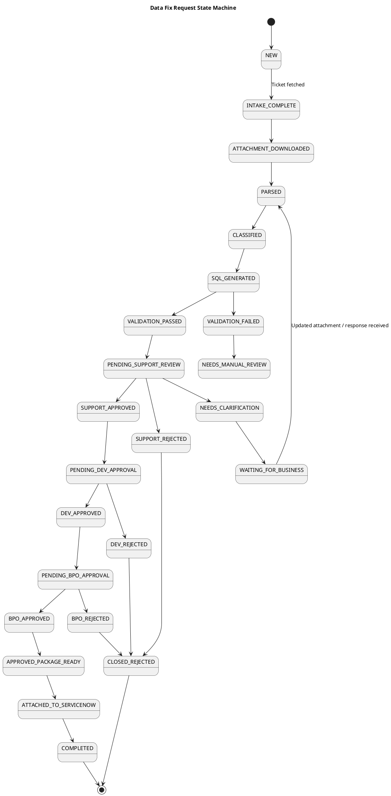
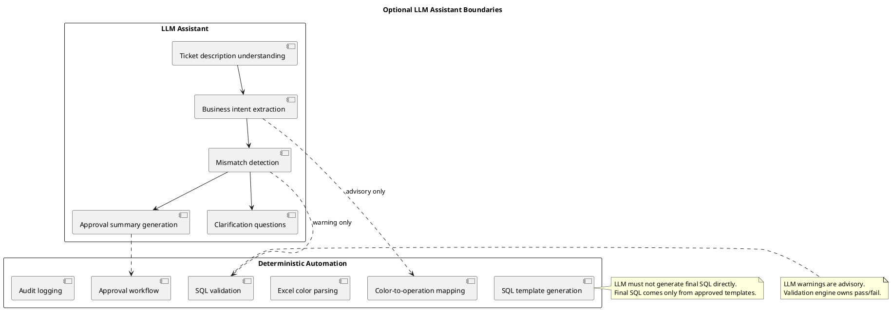
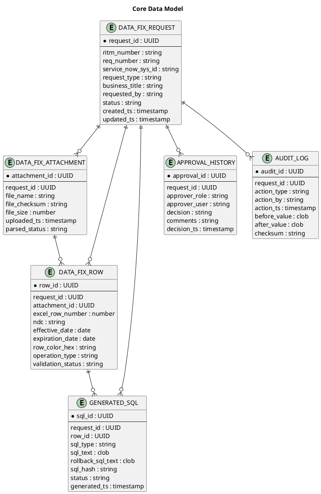

Below is a detailed design you can use as a starting architecture.

## 1. System context



---

## 2. High-level component design



---

## 3. End-to-end sequence flow



---

## 4. Human approval state machine



---

## 5. Where LLM actually fits



---

## 6. Core data model



---

## 7. Recommended approval package

For each ticket, generate a package with:

```text
1. Ticket summary
2. Attachment checksum
3. Parsed row summary
4. Insert/update/delete count
5. Validation report
6. Generated SQL
7. Rollback SQL
8. Approver checklist
9. Audit reference ID
```

## 8. My design recommendation

Build this as:

**SOX-Controlled Data Fix Automation Platform**

With optional:

**Data Fix Assistant**

The “assistant” uses LLM for summarization and discrepancy detection, but the SQL generation, approval flow, and audit trail should remain deterministic and rule-driven.
